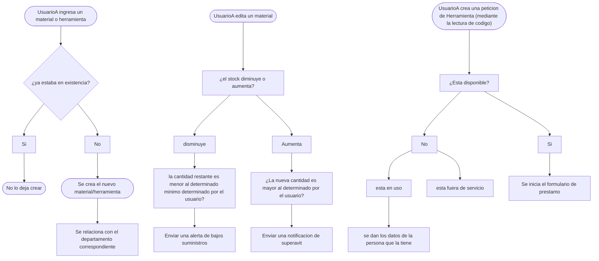

# 🏗️ GDC Frontend - Gestión de Grupo de Construcción  

Aplicación web para controlar herramientas, materiales y movimientos en proyectos de construcción.  

  

## **🚀 Características**  
- 📋 Registro de herramientas y materiales.  
- 🔄 Seguimiento de préstamos y devoluciones.  
- 📊 Reportes de inventario en tiempo real.  
- 🔐 Autenticación de usuarios (si aplica).  

## **🛠️ Tecnologías**  
- React.js + Vite  
- React Router (para navegación)  
- [Tailwind/Bootstrap] (para estilos)  
- [Otras librerías: axios, react-icons, etc.]  

## **⚙️ Instalación**  
1. Clona el repositorio:  
   ```bash
   git clone https://github.com/AldanaA1996/gdc-frontend.git
   cd gdc-frontend
Instala dependencias:

bash
npm install
Configura variables de entorno (crea .env):

env
VITE_API_URL=http://localhost:3000  # Ejemplo: URL del backend
Inicia la app:

bash
npm run dev
📂 Estructura del Proyecto
plaintext
src/
├── components/    # Botones, formularios, tarjetas
├── pages/         # Vistas (Inicio, Herramientas, Reportes)
├── context/       # Estado global (ej: AuthContext)
├── utils/         # Funciones auxiliares
└── App.jsx        # Rutas principal
🌐 Uso
Accede a http://localhost:5173 (puerto por defecto de Vite).

Si hay backend, asegúrate de que esté corriendo en paralelo.

🤝 Contribuir
Haz un fork del proyecto.

Crea una rama: git checkout -b feature/nueva-funcion.

Haz commit: git commit -m "Agrega X feature".

Haz push: git push origin feature/nueva-funcion.

Abre un Pull Request.

📄 Licencia
MIT. Ver LICENSE.

## **📊 Arquitectura del Sistema**

### **Flujo de Préstamos**

